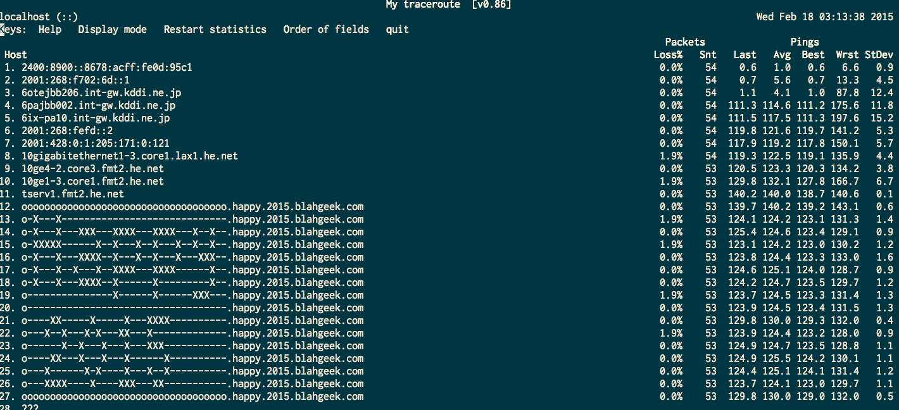

# bgtr

Make custom traceroute result on a single linux box.



For more details, see [My Blog](http://blog.blahgeek.com/bgtr/) (Chinese)

## Try it

```
mtr -6 happy.2015.blahgeek.com
```

## Howto

- Get a `/64` IPv6 pool, with rDNS support
- Using `ip6tables ... -j NFQUEUE` to queue specific packets to user space
- Drop those whose `hop limit` is less than NUM and send back an `Time Exceeded` ICMPv6 message, accept others

## Step-by-step Howto

- Goto [Tunnel Broker](http://tunnelbroker.net), register an tunnel, configure it. For me, `2001:470:1f05:42c::/64` is routed to my VPS.
- Pick a destination IP address, let's say `2001:470:1f05:42c:2015::`. Run:

```
ip6tables -t nat -I PREROUTING -d 2001:470:1f05:42c:2015:: -j NFQUEUE --queue-num 1
```

  So that all packets to `2001:470:1f05:42c:2015::` will be queued to user space (queue 1).

- Install python requirements: `pip install NetfilterQueue scapy`
- Run `main.py` on root. Change `PREFIX=` to your own IPv6 prefix.

Now, try run `mtr 2001:470:1f05:42c:2015::` from another machine and see the result. And finally you may want to make it prettier:

- Set *rDNS Delegations* to *dns.he.net* at Tunnel Broker, goto [HE.net DNS](http://dns.he.net) to setup rDNS for each address.
- Bind `2001:470:1f05:42c:2015::` to a domain like `happy.2015.blahgeek.com`
